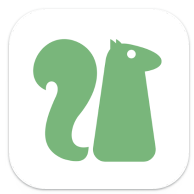

  

> [https://ubivpn.com](https://ubivpn.com)  
> [https://t.me/UbiVPN](https://t.me/UbiVPN)  

- English: UbiVPN is a free, ubiquitous VPN that protects your privacy and security, unlocking websites and streaming.
- Russian: UbiVPN - это бесплатный, повсеместный VPN, который защищает вашу конфиденциальность и безопасность, открывает доступ к веб-сайтам и стриминговым сервисам.
- Traditional Chinese: UbiVPN 是一款免費的無處不在的VPN，保護你的隱私安全，解鎖網站和流媒體。
- Persian: UbiVPN یک VPN رایگان و همه‌جا حاضر است که حریم خصوصی و امنیت شما را محافظت می‌کند، وب‌سایت‌ها و پخش زنده را باز می‌کند.
- Arabic: UbiVPN هو VPN مجاني ومتوفر في كل مكان يحمي خصوصيتك وأمانك، ويفتح المواقع الإلكترونية والبث المباشر.
- Turkmen: UbiVPN mugt, her ýerde bar bolan VPN, şahsyýetiňizi we howpsuzlygyňyzy gorap, websaýtlary we akym edýänleri açýar.
- Indonesian: UbiVPN adalah VPN gratis yang ada di mana-mana, melindungi privasi dan keamanan Anda, membuka situs web dan streaming.
- Japanese: UbiVPNは無料でどこにでもあるVPNで、あなたのプライバシーとセキュリティを守り、ウェブサイトとストリーミングを解除します。
- Spanish: UbiVPN es un VPN gratuito y omnipresente que protege tu privacidad y seguridad, desbloqueando sitios web y streaming.
- Hindi: UbiVPN एक मुफ्त, सर्वव्यापी VPN है जो आपकी गोपनीयता और सुरक्षा की रक्षा करता है, वेबसाइटों और स्ट्रीमिंग को अनलॉक करता है।

